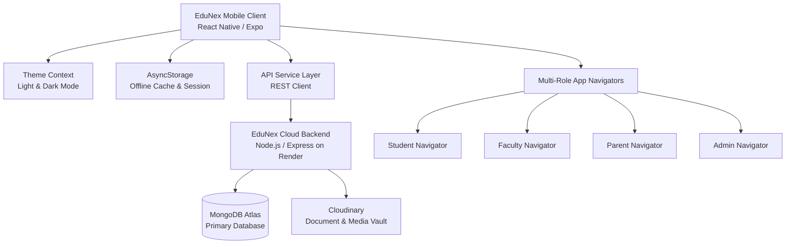

# 🎓 EduNex — Smart Autonomous Campus Operating System

<div align="center">

[](https://reactnative.dev/)
[](https://expo.dev/)
[](https://www.mongodb.com/)
[](https://edunex-backend-rmvx.onrender.com)
[](https://eslint.org/)
[](https://www.typescriptlang.org/)

**A Next-Generation, Multi-Role Autonomous Campus Management & Academic Operating System built with React Native, Expo, and MongoDB REST API.**

[Key Features](#-core-portals--feature-matrix) • [Architecture](#-system-architecture) • [Project Structure](#-project-directory-structure) • [Getting Started](#-getting-started) • [Tech Stack](#-technology-stack)

</div>

---

## 🌟 Overview

**EduNex** is an enterprise-grade academic mobile platform engineered for higher education universities and autonomous engineering institutes. It unifies institutional governance, faculty workflows, student academic tracking, and parent counseling into a unified, secure, real-time mobile application.

---

## 🚀 Core Portals & Feature Matrix

### 1. 🎓 Student Portal
* **Dashboard Command Center**: Live enrolled cohort identity, quick academic KPI cards (Attendance, CGPA, Credits, Cleared Dues), today's lecture schedule timeline, and campus notices ticker.
* **Locked Cohort Timetable**: Strict cohort-locked 5-day academic timetable (*e.g., B.Tech AI & DS, Year 3, Section A*) with subject period breakdown, faculty attribution, classroom venue tags, and 1-on-1 cabin consultation booking.
* **Academics & Grade Dossier**: Semester-by-semester SGPA & CGPA progression curves, Continuous Internal Assessment (CIA) marks, credits cleared, and verified course syllabus tracker.
* **Fees Management & UPI Gateway**: Outstanding dues ledger, categorized invoice receipts, scholarships/grants breakdown, and direct multi-method payment modal (UPI, Cards, Net Banking).
* **Document Vault & KYC Space**: Verified digital space for submitting and inspecting 10th/12th marksheets, transfer certificates, community affidavits, and government ID credentials.
* **College Leave & Academic On-Duty (OD) Hub**: Digital leave and symposium OD application with multi-level approval pipeline (Advisor ➔ HOD ➔ Dean) and live QR gate clearance pass.
* **Hostel Gate Pass & Outing Permitting**: Weekend home visit and local day outing permits with curfew countdown timer, parent consent attribution, and biometric security turnstile QR verification.
* **Counselor 1-on-1 Encrypted Chat**: End-to-end encrypted direct messaging channel between students and designated department faculty advisors.

---

### 2. 👨‍🏫 Faculty & Staff Portal
* **Faculty Command Center**: Professor profile hero with live in-session class indicators, 4-metric KPI power strip, quick-action operations grid, and teaching timeline.
* **Digital Attendance Studio & Freeze Ledger**: 3-state attendance roll call (`[P] Present`, `[A] Absent`, `[OD] On-Duty`), section & lab switcher, bulk marking, and a strict **Pre-Lock Confirmation & Freeze Ledger Workflow** with HOD administrative override protections.
* **Student Directory & Academic Dossier**: Complete student roster filtered by section, batch, mentee wards, and critical attendance (<75%), featuring 1-tap call student/guardian shortcuts and full academic dossier bottom sheets.
* **CIA & Lab Assessment Grading**: Grade Continuous Internal Assessment submissions, practical lab experiments, and moderate student marks.
* **Faculty Messages & Parent Inquiry Hub**: Centralized hub for resolving parent counseling inquiries and managing class broadcast circulars.
* **Academic Teaching Schedule**: Weekly schedule covering theory lectures, practical computing labs, and designated student cabin consultation office hours.

---

### 3. 👨‍👩‍👧 Parent & Guardian Portal
* **Ward Performance Hub**: Real-time campus presence status, attendance rate gauge, CGPA standings, cleared credits, and designated class advisor direct-dial shortcuts.
* **Parent Fee Settlement & Invoices**: Fee summary with settlement progress bar, pending invoice breakdown, paid receipts archive, and university bank transfer details.
* **Parent Messages & Circulars Suite**: Dual-mode communication hub switching between official institution circulars and direct counselor chat.
* **Campus Gate & Biometric Turnstile Log**: Real-time biometric entry/exit logs tracking turnstile gate scans with date/time stamps.
* **Exam Portions & Assessment Calendar**: CIA mid-term exam schedule, syllabus portions, room allocations, and assessment weightage.
* **Institutional Feedback & Inquiries**: Multi-department query submission with category selection, star satisfaction ratings, and historical resolution tracking.

---

### 4. 🛡️ Administrator & Governance Console
* **Master Governance Console**: System status monitor, active user count metrics, cluster latency indicators, and server health diagnostics.
* **Multi-Role User Onboarding Suite**: Create and enroll `Student`, `Faculty`, `Parent`, and `Admin` records individually or via bulk Excel/CSV file upload with automatic roll number and employee ID sequence generation.
* **Master System Settings**: Academic year controls, semester cutoff dates, grade lock permissions, minimum attendance thresholds (75%), and 2-Factor Authentication toggles.
* **Cloud Backup & Diagnostics**: 1-Tap database snapshot creation, cache clearance, MongoDB cluster ping tests, and emergency campus announcement broadcast.

---

## 🏛️ System Architecture



---

## 📁 Project Directory Structure

```
d:/edunex/
├── app/
│   ├── _layout.tsx                     # Root application layout & route setup
│   ├── index.tsx                       # Initial splash & auth state dispatcher
│   ├── components/
│   │   ├── common/                     # Reusable loaders, skeletons, toast alerts
│   │   │   ├── SkeletonLoader.js
│   │   │   └── Toast.js
│   │   ├── header/                     # Top portal headers & modals
│   │   │   ├── Header.js               # Student Portal Header
│   │   │   ├── HeaderStaff.js          # Faculty Portal Header
│   │   │   ├── HeaderParent.js         # Parent Portal Header
│   │   │   ├── HeaderAdmin.js          # Admin Console Header
│   │   │   ├── modal/                  # Student & Faculty common modals
│   │   │   ├── amodal/                 # Admin onboarding modals (AddUserModal)
│   │   │   ├── pmodal/                 # Parent assessment & gate log modals
│   │   │   └── settings/               # Master System Settings modal
│   │   └── nav/                        # Role-based Tab Navigators
│   │       ├── AppNavigatorStudent.js
│   │       ├── AppNavigatorStaff.js
│   │       ├── AppNavigatorParent.js
│   │       └── AppNavigatorAdmin.js
│   ├── context/
│   │   └── ThemeContext.js             # Universal Light & Dark theme provider
│   ├── screens/
│   │   ├── auth/                       # Login screen & password reset modals
│   │   │   └── LoginScreen.js
│   │   ├── students/                   # Student screens & feature modals
│   │   │   ├── DashboardScreen.js
│   │   │   ├── AcademicsScreen.js
│   │   │   ├── FeesScreen.js
│   │   │   ├── AdmissionFormScreen.js
│   │   │   ├── ProfileScreen.js
│   │   │   └── modals/                 # FullTimeTable, LeaveModal, HostelModal, etc.
│   │   ├── staff/                      # Faculty portal screens & modals
│   │   │   ├── DashboardStaff.js
│   │   │   ├── AttendanceStaff.js
│   │   │   ├── StudentsStaff.js
│   │   │   ├── FeesStaff.js
│   │   │   ├── ProfileStaff.js
│   │   │   └── modals/                 # AttendanceModal, ReportsModal, MessagesModal, etc.
│   │   ├── parents/                    # Parent portal screens
│   │   │   ├── DashboardParent.js
│   │   │   ├── WardDetailsParent.js
│   │   │   ├── FeesParent.js
│   │   │   ├── MessagesParent.js
│   │   │   └── ProfileParent.js
│   │   └── admin/                      # Administrator screens
│   │       ├── DashboardAdmin.js
│   │       ├── ManageUsersAdmin.js
│   │       ├── ReportsAdmin.js
│   │       └── SystemSettingsAdmin.js
│   ├── services/
│   │   ├── api.js                      # Central Axios instance & token interceptors
│   │   └── dataService.js              # Business logic & data fetching adapters
│   └── utils/
│       ├── toastService.js             # Global event toast dispatcher
│       └── SuccessAnimation.js         # Animated status feedback
├── package.json
├── tsconfig.json
├── eslint.config.js
└── README.md
```

---

## 🛠️ Technology Stack

| Layer | Technology / Library |
| :--- | :--- |
| **Framework** | [React Native 0.76.7](https://reactnative.dev/) / [Expo SDK 52](https://expo.dev/) |
| **Routing** | [Expo Router](https://docs.expo.dev/router/introduction/) |
| **Styling & UI** | React Native StyleSheet, [Expo Linear Gradient](https://docs.expo.dev/versions/latest/sdk/linear-gradient/) |
| **Iconography** | [React Native Vector Icons (MaterialCommunityIcons)](https://oblador.github.io/react-native-vector-icons/) |
| **State & Storage** | React Context API, [`@react-native-async-storage/async-storage`](https://react-native-async-storage.github.io/async-storage/) |
| **QR Code Engine** | [`react-native-qrcode-svg`](https://github.com/awesomejerry/react-native-qrcode-svg) |
| **File & Media** | [`expo-document-picker`](https://docs.expo.dev/versions/latest/sdk/document-picker/), [`expo-image-picker`](https://docs.expo.dev/versions/latest/sdk/imagepicker/), [`xlsx`](https://sheetjs.com/) |
| **Backend REST API** | Node.js / Express deployed on [Render](https://render.com) |
| **Database** | [MongoDB Atlas](https://www.mongodb.com/atlas) (Cloud Cluster) |
| **Code Quality** | ESLint (`expo lint`), TypeScript (`tsc --noEmit`) |

---

## ⚡ Getting Started

### Prerequisites
* **Node.js**: `v18.x` or `v20.x` installed
* **Package Manager**: `npm` or `yarn`
* **Expo CLI**: Installed globally or executed via `npx`
* **Expo Go App**: (Optional) Installed on iOS / Android physical devices for live testing

### 1. Installation
Clone the repository and install dependencies:
```bash
git clone https://github.com/rider05/EduNex.git
cd EduNex
npm install
```

### 2. Environment Configuration
The application connects to the cloud backend at:
```env
EXPO_PUBLIC_API_URL=https://edunex-backend-rmvx.onrender.com/api/v1
```

### 3. Launch Development Server
Start the Expo Metro bundler:
```bash
npx expo start
```
* Press `a` to launch in an **Android Emulator**.
* Press `i` to launch in an **iOS Simulator**.
* Scan the QR code using the **Expo Go** application on your physical device.

---

## 🧪 Code Quality & Verification

The codebase adheres to clean architecture principles with strict linting and type-checking standards:

```bash
# Run ESLint validation
npm run lint

# Run TypeScript type safety verification
npx tsc --noEmit
```

> **Validation Status**: `0 Errors` · `0 Warnings` maintained across all portal screens and component suites.

---

## 🔒 Security & Compliance

* **FERPA & Institutional Privacy**: Zero-knowledge encryption standard for counselor messages and student academic records.
* **Biometric QR Gate Passes**: Time-bounded cryptographic QR signatures prevent forged campus gate departures.
* **Attendance Ledger Locking**: Cryptographic freeze preventing tampering with official attendance records once finalized.
* **Role-Based Access Control (RBAC)**: Strict permission boundaries ensuring users access only their authorized portal space.

---

## 👥 Authors & Acknowledgments

* **Engineering Team**: EduNex Core Mobile & Platform Development Team
* **Backend Cloud Infrastructure**: Hosted on Render with MongoDB Atlas Distributed Clusters

<div align="center">
  <sub>Built with ❤️ for Higher Education Excellence · © 2026 EduNex Inc. All rights reserved.</sub>
</div>
